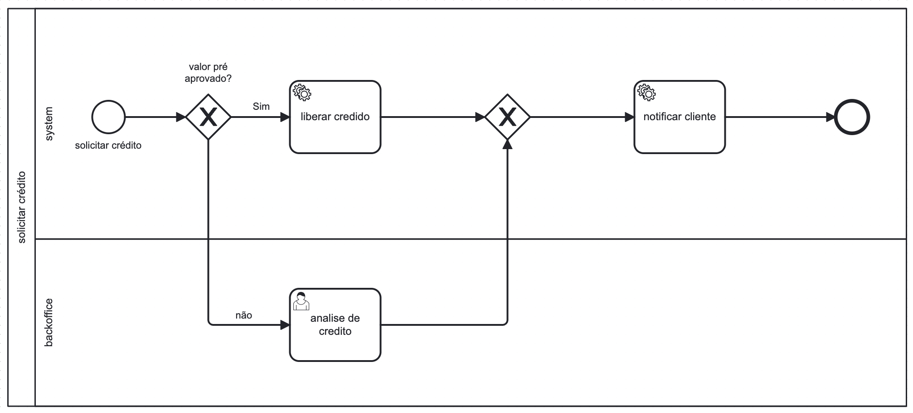
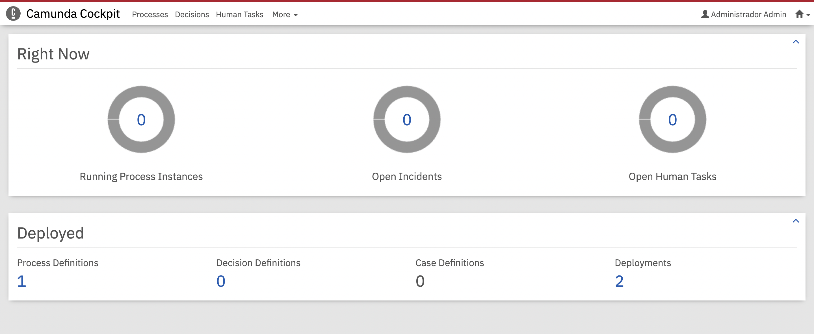
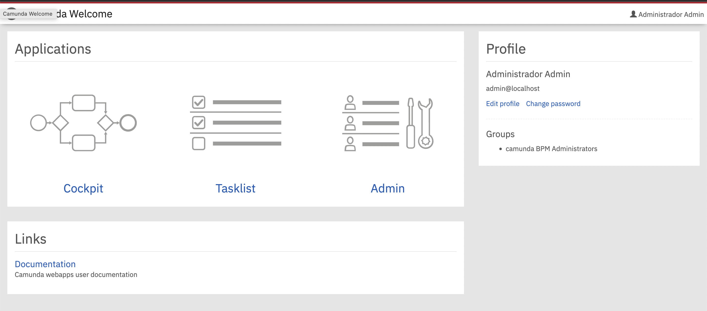

utilizando camunda modeler nós desenhamos um processo e exportamos o `.xml` gerado

criamos um projeto java com camunda initializer

pegamos o arquivo `.xml` do processo e colocamos dentro do projeto na pasta `/resources`

quando o projeto builda, ele sobe uma UI completa de administração do camunda no localhost:8080, 
pra podermos iniciar os processos, os processos automaticos serão executados pelas classes Java,
e a plataforma irá notificar usuarios para executar as tarefas humanas

vídeo demo em https://github.com/DeveloperArthur/-RPA-Process-Automation/blob/main/primeiro%20processo%20automatizado/src/main/resources/assets/demo.mov

é possivel tambem fazer todas as atividades da UI por API Rest, por exemplo iniciar o processo:

    curl -X POST -H "Content-Type: application/json" -d '{
    "variables": {
    "nome": {"value": "Jose da Silva", "type": "String"},
    "aprovado": {"value": true, "type": "Boolean"}
    }
    }' http://localhost:8080/engine-rest/process-definition/key/Process_1f0z70k/start

e para executar tarefas humanas via API Rest também.